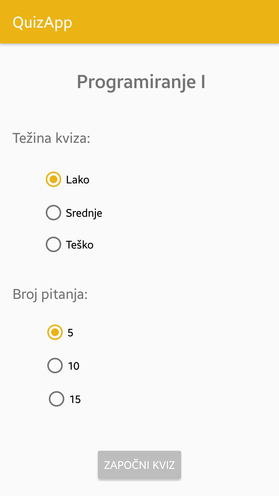
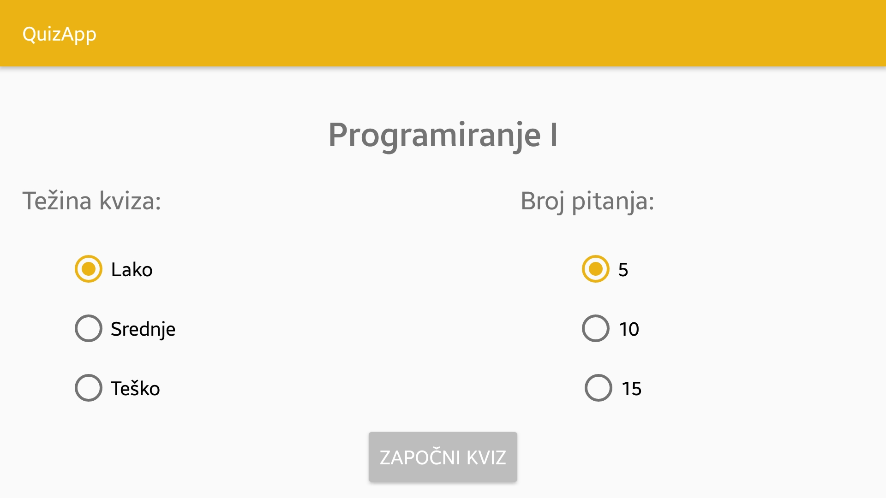

# Dokumentacija za Projekat I – Kviz aplikacija za predmet Programiranje I 

>*Prirodno-matematički fakultet*
>*Odsjek za matematiku*
>*Predmet: Razvoj mobilnih aplikacija*
>*Student: Almedina Alibašić*

---

### Opis aplikacije
Ovaj projekat je zapravo Android kviz aplikacija specijalizirana i namijenjena studentima predmeta Programiranje I. Kviz sadrži pitanja različite težine. 
Postoje tri nivoa težine:
- Lako
- Srednje
- Teško

Prije početka kviza korisnik bira jednu od tri navedene težine kviza kao i broj pitanja. To možemo vidjeti na sljedećim fotografijama:

Odabrana težina određuje distribucije težine pitanja. 
Težina "Lako" će imati 60% pitanja iz kategorije lakih pitanja, 20% pitanja iz kategorije srednjih i 20% pitanja iz kategorije teških pitanja. 
Težina "Srednje" će imati 20% pitanja iz kategorije lakih, 60% pitanja iz kategorije srednjih i 20% pitanja iz kategorije teških pitanja.
I težina "Teško" će imati 20% pitanja iz kategorije lakih i 20% pitanja iz kategorije srednjih te 60% pitanja iz kategorije teških pitanja.

Nakon što korisnik odabere težinu, pritiskom na dugme "Započni kviz" kviz započinje. Korisniku se prikazuju pitanje i 4 ponuđene opcije za odgovor na dato pitanje.
Odabirom neke od ponuđenih opcija, generiše se iduće pitanje sa svoje 4 opcije. Postupak se ponavlja onoliko puta koliko je pitanja korisnik odabrao prije početka kviza.

Po okončanju kviza, korisniku se prikazuje broj ostvarenih tačnih odgovora te mu se nudi opcija ponovnog igranja kviza ili napuštanja aplikacije.
Ukoliko odabere opciju ponovnog igranja, korisnik ponovo bira težinu kviza i broj pitanja.

*Napomena:* Projekat nije u potpunosti završen. Sljedeće funkcionalnosti nisu implementirane:
- Bočni meni
- "Share" meni za mogućnost dijeljenja rezultata
- Džoker
- Od tipova pitanja postoji samo "Pitanje sa višestrukim izborom"
Također, zbog nedostatka vremena, u aplikaciji se ne nalaze stvarna pitanja iz predmeta *Programiranje I* nego samo testna pitanja.

### Opis arhitekture aplikacije
Aplikacija se sastoji od dvije aktivnosti (MainActivity, PlayActivity), njima odgovarajućih layout-a (activity_main.xml, activity_play.xml) te jedne klase Questions.
*Aktivnost* (eng. Activity) je aplikacijska komponenta koja predstavlja "ekran" preko kojeg korisnik može da vrši interakciju sa aplikacijom.
*Layout* predstavlja vizuelnu strukturu aktivnosti. Svi elementi se raspoređuju u layoute, koji određuju kako i gdje će koji objekt biti smješten.
Aktivnosti pridružujemo određeni layout naredbom *setContentView()* koja prima id našeg layouta odnosno ime layouta sa R.layout ispred imena. Iniciranje layouta se odrađuje u metodi *onCreate()*, tj. prilikom nastanka aktivnosti, osim ako nam nije potrebno drugačije.
U ovoj aplikaciji, iz MainActivity se lansira aplikacija i prikazuje activity_main layout. Tada korisnik bira težinu kviza i broj pitanja i nakon što pritisne na dugme "Započni kviz", 
unutar setOnClickListener-a za to dugme, vrijednosti koje je odabrao se spremaju u varijable u MainActivity aktivnosti te se pokreće sljedeća aktivnost PlayActivity.
Iz MainActivity u PlayActivity prosljeđujemo dvije vrijednosti, broj pitanja i težinu kviza koje je korisnik odabrao.
Unutar PlayActivity inicijaliziramo pitanja, ponuđene opcije za odgovor, vršimo provjeru odgovora te provjeru da li je došlo do kraja kviza.
Također, unutar njega vršimo i prikazivanje broja tačnih odgovora korisniku nakon završetka kviza kao i opcije ponovnog igranja ili izlaska iz aplikacije.

Za oba layout-a, activity_main.xml i activity_play.xml, postoje i Portrait i Landscape verzije kako bi izgled aplikacije bio regulisan i za horizontalne i vertikalne ekrane.
Gubitak podataka prilikom rotacije ekrana je izbjegnut zahvaljujući metodama *onSaveInstanceState()* i *onRestoreInstanceState()*.
Kad rotiramo ekran, trenutna aktivnost se uništava, a kreira se nova aktivnost. Metoda **onSaveInstanceState()** čuva instancu trenutne aktivnosti koja će biti uništena, tj. unutar nje smo sačuvali varijable koje će biti poništene,
dok **onRestoreInstanceState()** vraća sačuvano stanje prethodne aktivnosti, tj unutar nje vraćamo vrijednost varijablama. Na ovaj način ne dolazi do gubitka podataka prilikom rotacije ekrana. 

